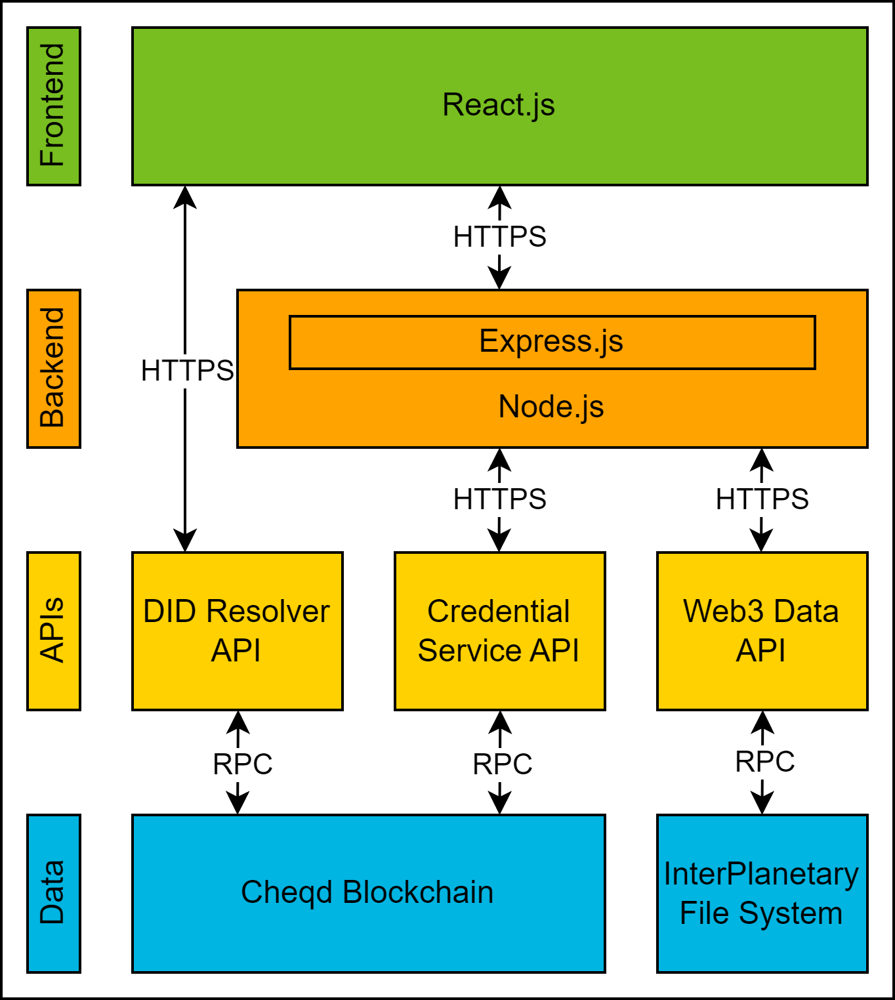

# DIDChain
DIDChain is framework for a verifiable supply chain data management system (VSCDMS). This repo contains an implementation of it in the form of an web app. Moreover, a test suite for DIDChain's performance is included. 

## DIDChain web app

### Architecture

### Frontend
#### UI for documenting supply chain events

#### UI for tracing products and their compartments
